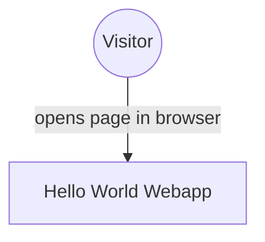
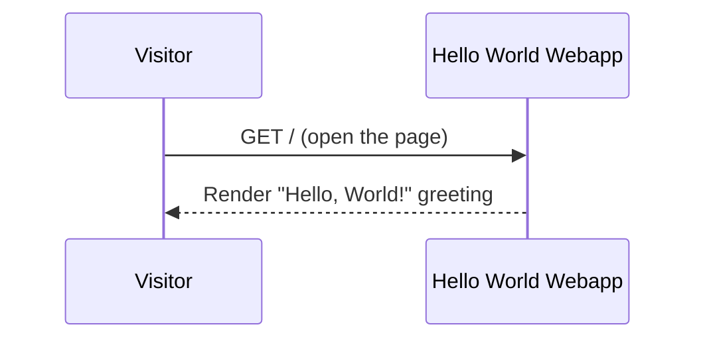

# Hello World Webapp — Design

## Overview

A single public web application serves one static page that greets every visitor with "Hello, World!". There is no backend, no persistence, no authentication, and no personalization — the entire system is one deployable SPA rendered directly to the browser.

## Context (C1)

## Domain model (ER)

No persisted entities exist — the app renders a fixed greeting with no stored or dynamic data.

## Key flows

